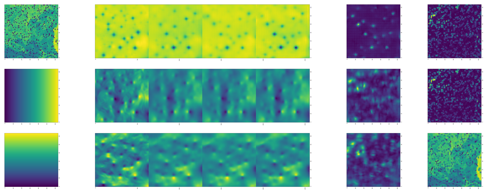
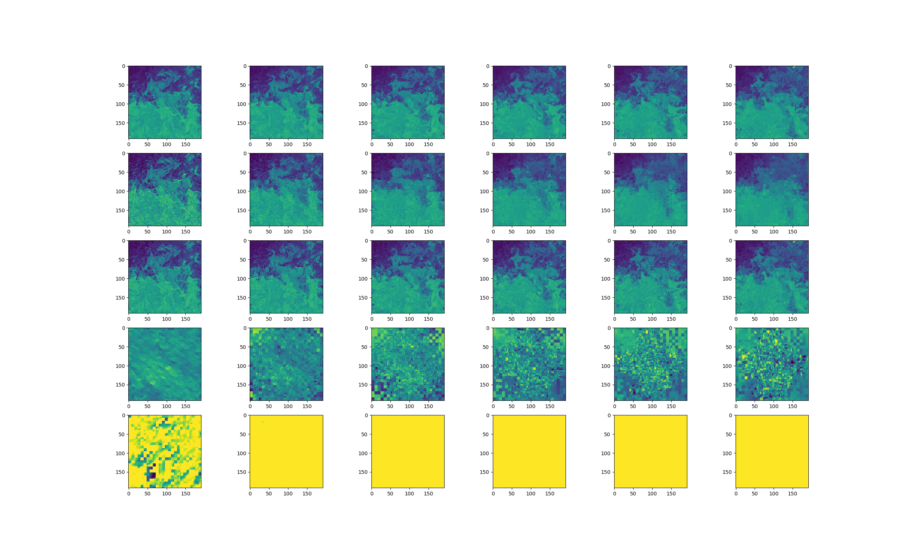

# Score-Based Generative Modeling through Stochastic Differential Equations
B-PINN-Kalman filter is a deep learning model aiming to address the general **Inverse Problem (IP)** by leveraging physical prior knowledge and probabilistic formulation. 
The first stage **Bayesian Physics-Informed Neural Network (B-PINN)** will infer the velocity and pressure field, and the corresponding uncertainty, based on the previous observations $x_i, x_{i-1}$. Then, a Kalman Filter (KF) will leverage the model prediction and the physical prediction from the previous step. This final output will be the denoised hidden state $$y_i$$. 

This repository is based on the code from the paper **Score-Based Generative Modeling through Stochastic Differential Equations**.

<div align="center">
  
</div> 
<div align="center">
  
</div>

## How to run the code

### Dependencies

Run the following to install a subset of necessary python packages for our code
```sh
pip install -r requirements.txt
```

### Stats files for quantitative evaluation

We provide the stats file for CIFAR-10. You can download [`cifar10_stats.npz`](https://drive.google.com/file/d/14UB27-Spi8VjZYKST3ZcT8YVhAluiFWI/view?usp=sharing)  and save it to `assets/stats/`. Check out [#5](https://github.com/yang-song/score_sde/pull/5) on how to compute this stats file for new datasets.

### Usage

Train and evaluate our models through `main.py`.

```sh
main.py:
  --config: Training configuration.
    (default: 'None')
  --eval_folder: The folder name for storing evaluation results
    (default: 'eval')
  --mode: <train|eval>: Running mode: train or eval
  --workdir: Working directory
```

* `config` is the path to the config file. Our prescribed config files are provided in `configs/`. They are formatted according to [`ml_collections`](https://github.com/google/ml_collections) and should be quite self-explanatory.

  **Naming conventions of config files**: the path of a config file is a combination of the following dimensions:
  *  dataset: One of `cifar10`, `celeba`, `celebahq`, `celebahq_256`, `ffhq_256`, `celebahq`, `ffhq`.
  * model: One of `ncsn`, `ncsnv2`, `ncsnpp`, `ddpm`, `ddpmpp`.
  * continuous: train the model with continuously sampled time steps. 

*  `workdir` is the path that stores all artifacts of one experiment, like checkpoints, samples, and evaluation results.

* `eval_folder` is the name of a subfolder in `workdir` that stores all artifacts of the evaluation process, like meta checkpoints for pre-emption prevention, image samples, and numpy dumps of quantitative results.

* `mode` is either "train" or "eval". When set to "train", it starts the training of a new model, or resumes the training of an old model if its meta-checkpoints (for resuming running after pre-emption in a cloud environment) exist in `workdir/checkpoints-meta` . When set to "eval", it can do an arbitrary combination of the following

  * Evaluate the loss function on the test / validation dataset.

  * Generate a fixed number of samples and compute its Inception score, FID, or KID. Prior to evaluation, stats files must have already been downloaded/computed and stored in `assets/stats`.

  * Compute the log-likelihood on the training or test dataset.

  These functionalities can be configured through config files, or more conveniently, through the command-line support of the `ml_collections` package. For example, to generate samples and evaluate sample quality, supply the  `--config.eval.enable_sampling` flag; to compute log-likelihoods, supply the `--config.eval.enable_bpd` flag, and specify `--config.eval.dataset=train/test` to indicate whether to compute the likelihoods on the training or test dataset.

#### Example

- Train
```sh
python main.py 
  --config=configs/vp/nc_chl_ddpmpp.py 
  --mode=train  
  --workdir=workdir/nc-chl
```

- Sample
```sh
python main.py 
  --config=configs/vp/nc_ddpmpp.py 
  --mode=sample  
  --ckptdir=workdir/nc-theta/checkpoints/checkpoint_1.pth 
  --workdir=sample/sample_nc
```

- Inverse
```sh
python main.py 
  --config=configs/inverse/nc_ddpmpp_inpaint_dps.py 
  --mode=inverse 
  --ckptdir=workdir/nc-theta/checkpoints/checkpoint_5.pth 
  --workdir=workdir/nc-theta/inverse
```

- Train PINN
```sh
python main.py
  --config=configs/pinn/pinn_pde.py 
  --mode=train_pinn  
  --workdir=workdir/pde-pinn
```

- Train B-PINN
```sh
python main.py 
  --config=configs/pinn/pinn_pde.py 
  --mode=train_bpinn  
  --workdir=workdir/pde-bpinn 
  --ckptdir=workdir/pde-pinn/checkpoints-meta/checkpoint.pth
```

## How to extend the code
* **New SDEs**: inherent the `sde_lib.SDE` abstract class and implement all abstract methods. The `discretize()` method is optional and the default is Euler-Maruyama discretization. Existing sampling methods and likelihood computation will automatically work for this new SDE.
* **New predictors**: inherent the `sampling.Predictor` abstract class, implement the `update_fn` abstract method, and register its name with `@register_predictor`. The new predictor can be directly used in `sampling.get_pc_sampler` for Predictor-Corrector sampling, and all other controllable generation methods in `controllable_generation.py`.
* **New correctors**: inherent the `sampling.Corrector` abstract class, implement the `update_fn` abstract method, and register its name with `@register_corrector`. The new corrector can be directly used in `sampling.get_pc_sampler`, and all other controllable generation methods in `controllable_generation.py`.

# Reference

```bib
@inproceedings{
  song2021scorebased,
  title={Score-Based Generative Modeling through Stochastic Differential Equations},
  author={Yang Song and Jascha Sohl-Dickstein and Diederik P Kingma and Abhishek Kumar and Stefano Ermon and Ben Poole},
  booktitle={International Conference on Learning Representations},
  year={2021},
  url={https://openreview.net/forum?id=PxTIG12RRHS}
}
```


